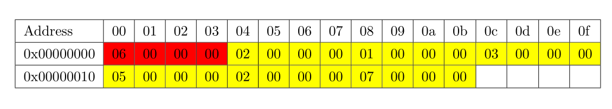

# The Fundamentals of Digital Logic and Processors First Project: Assembly Language

2024/04/10

## 1. Project introduction

In this project, you are required to convert the C++ codes to MIPS instructions in assembly language and finish the process of compiling, running, debugging the assembly codes, and passing the test using the MARS simulator. In this project, you are expected to understand how to convert the algorithms in the high-level language to assembly language, how the hardware structure in the MIPS processor implements the instructions, and how to program and debug the assembly code.

There are two parts for this project: the basic exercise and the practical application. In the basic exercise part, you will practice the common operations in MIPS, and learn how to program the assembly code. In the practical application part, an assembly program with complete algorithm functions will be written based on the C language codes corresponding to three different algorithms.

## 2. Project requirement

The requirements of this project are as follows: 

Upload the compressed files to WEB learning before 05/08/2024 23:59. The name should be “`your ID_your name.xxx`”. “`xxx`” is the compression format. The zip format is recommended, and other common compression formats, such as rar and 7z, can be also used. The unzipped files should include:

A “`report.pdf`”. The contents are required to be brief and divided into two parts: 

1. For the basic exercise part, describe the codes and functions briefly;

2. For the practical application part, describe the relationship between registers and variables, the operations during the procedure call, and the final results.

A “`exp1`” folder including “`exp1_1.asm`”, “`exp1_2.asm`”, “`exp1_3.asm`” and “`exp1_4.asm`” (four files in total); 

A “`exp2`” folder including “`insert_sort.asm`”, “`binary_insert_sort.asm`” and “`merge_sort.asm`” (three files in total).

The appeared letters of all files (including the filename extension) above **should be lowercase**.

Note: Partial scores of this project are given by the script automatically. **If the script fails to find the codes for evaluation due to the incorrect format, corresponding scores will be deducted.**

## 3. Notes

1. For all assembly codes in MIPS for this project, corresponding C/C++ codes have been provided (in the folders `exp1` and `exp2`). The assembly codes should correspond to the provided C/C++ codes. **No other C/C++ codes can be used**.

2. The project should be finished independently, and **no cheating is tolerated**, including but not limited to copying the codes of any other students, copying the open-source codes in networks, copying the codes generated by ChatGPT, etc. If we find you cheating, you will get the score 0 for this project, and be punished strictly according to the Tsinghua rules and regulations.

## 4. Contact

If you have any questions about this project, contact the TAs for this project:

## Part 1: Basic Exercise

### Exercise 1-1: System Call (`exp1_1.asm`)

Learn to use the system call (`syscall`) in the MARS simulator, including file read/write, command read/write (standard input and output), memory allocation, etc. The basic usage of the system call includes:

- Write the required arguments to the register `$a*` (optional);

- Write the called `syscall` number to the register `$v0`;

- Use the command “`syscall`” for calling the process;

- Read the return value from `$v0` (optional)

For more detailed usage, please refer to the contents in Help of the MARS simulator. The codes in `exp1_1.cpp` mainly include:

- Allocate a memory space in multiple of 8 bytes;

- Read two integers from “`a.in`”;

- Write these two integers to “`a.out`”;

- Input an integer i by the keyboard;

- i = i + 10;

- Print this integer on the screen.

Input file and output file format: The input file name is “`a.in`”, and the output file name is “`a.out`”. Both these two files are in binary format. In the folder “`exp1`”, there is a file “`a.in`” including two integers (1 and 10) as the test example. 

Hint: for the instructions for opening files in MIPS, $flag=0$ for the read-only mode; $flag=1$ for the write-only mode; $flag=2$ for the write-read mode.

### Exercise 1-2: Loop and Branch (`exp1_2.asm`)

Achieve the functions in `exp1_2.cpp` using the assembly language in MIPS and upload the assembly codes. It is good to add the annotations in the codes for better readability. The codes in `exp1_2.cpp` mainly include:

- Covert the input i to its opposite number and covert the input j to its absolute value (j is an integer and j ≠ 0);

- From i, loop j rounds, and i = i+1 each round.

Output format requirement: **The final result should be stored in register `$v0`** at the end of the program. The scores will be deducted if you fail to output the final results as required.

### Exercise 1-3: Array and Pointer (`exp1_3.asm`)

Achieve the functions in `exp1_3.cpp` using the assembly language in MIPS and upload the assembly codes. It is good to add the annotations in the codes for better readability. The codes in `exp1_3.cpp` mainly include:

- Input the length n of the array a (n is always an even number);

- Input n integers;

- Add 1 for all elements in the array a, and store them in a in reverse order;

- Print the value of the array a.

Hint: The system call 9 in MIPS has similar functionality to the new in C language. This instruction can allocate the memory space for n integers, and the input parameters are n * 4. The return value is the first address of this memory space.

### Exercise 1-4: Function Call (`exp1_4.asm`)

The C++ codes for the Hanoi are provided in `exp1_4.cpp`. Please complete the MIPS codes and gradually complete the compilation of function calls so that it can complete the task of calculating $Hanoi(n)$.

## Part 2: practical application

### Experimental contents

Use MIPS32 assembly instructions to convert the C++ codes of the following three sort algorithms into corresponding assembly language for execution, debug the codes and obtain correct results. **Meanwhile, you also need to count the number of comparisons during the three sort algorithms and output them at the same time as the sorting results.**

#### 1. Direct insertion sort

The process of direct insertion sort is similar to shuffling cards. We will insert the playing cards into the ordered poker sequence one by one, and select the proper insertion position so that the new sequence after insertion is still ordered. The specific workflow is shown in the figure above.

The purpose of the direct insertion sort exercise is to be familiar with the basic operations and practice file read/write. The corresponding C++ code file is named "`insert_sort.cpp`", and the assembly code file you should submit is named "`insert_sort.asm`".

### 2. Binary insertion sort

Binary insertion sort is similar to direct insertion sort. The difference is that when searching for the insertion position, direct insertion sort uses a sequential search, while binary insertion sort uses the binary search method. **Therefore, when implementing binary insertion sort, you can directly make changes based on the assembly code of direct insertion sort.**

The purpose of the binary insertion sort exercise is to be familiar with the recursive function calls, the stack push and pop operations, etc. The corresponding C++ code file is named "`binary_insert_sort.cpp`", and the assembly code file you should submit is named "`binary_insert_sort.asm`".

### 3. Merge sort (linked list)

Merge sort will split the sequence to be sorted into two parts, sort them separately and then merge them. When sorting each divided subsequence, the subsequence will be divided again into two smaller sequences, sorted and then merged. In general, this "split-merge" process will be performed recursively until the subsequence cannot be split. Its specific workflow is shown in the figure above.

The purpose of the merge sort (linked list) exercise is to be familiar with the operations related to pointers and array linked lists. We provide two versions of C++ codes, among which ***"`merge_sort.cpp`" is the source code that should be referenced when compiling manually***, and the other version "`merge_sort_runnable.cpp`" is the runnable version on the 64-bit operating systems. The assembly code file you should submit is named "`merge_sort.asm`".

## Input/Output format

 

All three sort algorithms need to read the file "`a.in`" and then write the file "`a.out`".

The input file "`a.in`" is a little-endian binary file with 4 × (N + 1) bytes. The first 4 bytes are a positive integer N (**N<=1000**), and N is the number of data to be sorted. The next 4N bytes are N positive integers (each positive integer occupies 4 bytes, and they are all less than $2^{16}$). For example, in the input sample shown above, N = 6, followed by 6 positive integers to be sorted.

The output file "`a.out`" is also a little-endian binary file with 4 × (N + 1) bytes. **The first 4 bytes are the number of comparisons you count**, and the subsequent 4N bytes are the sorting results of N positive integers.

## Test sample

We provide an input sample "`a.in`" in the `exp2` folder, in which the first 4 bytes are 20, and there are 20 subsequent 4-byte positive integers to be sorted. You can run the C++ code and assembly code corresponding to the sort algorithm at the same time to check if your sort results and the number of comparisons are correct.

For this test example, running the C++ code shows that the number of comparisons for direct insertion sort is 103, the number of comparisons for binary insertion sort is 62, and the number of comparisons for merge sort is 76. The sorted result is a sequence of positive integers in ascending order, which can be checked by yourself.

## Notes

This project provides the C++ codes for three different sorting algorithms: direct insertion sort algorithm (`insert_sort.cpp`), binary insertion algorithm (`binary_insert_sort.cpp`) and merge sort algorithm (`merge_sort.cpp`). The C++ codes provided in this project **have contained the statistics on the number of comparisons during the sort process**, and the corresponding code is in the "`exp2`" folder.

You are required to implement three sort algorithms in three assembly code files. The file names of the assembly code should correspond to the C file names. When submitting your project, you only need to upload three copies of the assembly code you implemented and store them in the correct location according to the submission requirements (see Part 2 of the document for details). In the assembly code, necessary annotations are recommended to explain the codes so that TAs can grade it easily. The principles of these algorithms are not required in this project. For the corresponding algorithm principles, you can refer to the corresponding courseware of courses such as *Data Structures & Algorithms*. 
