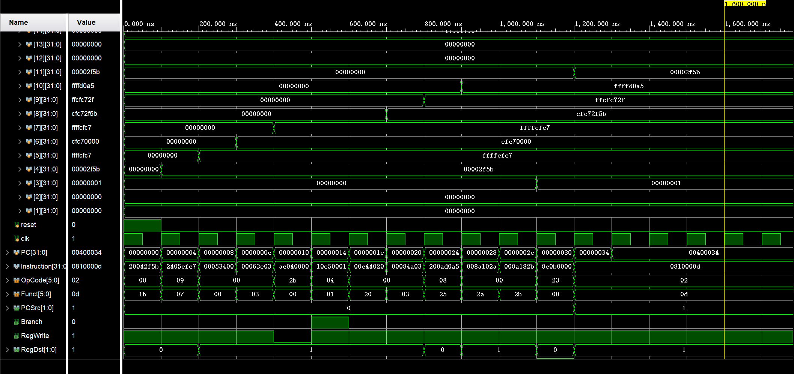
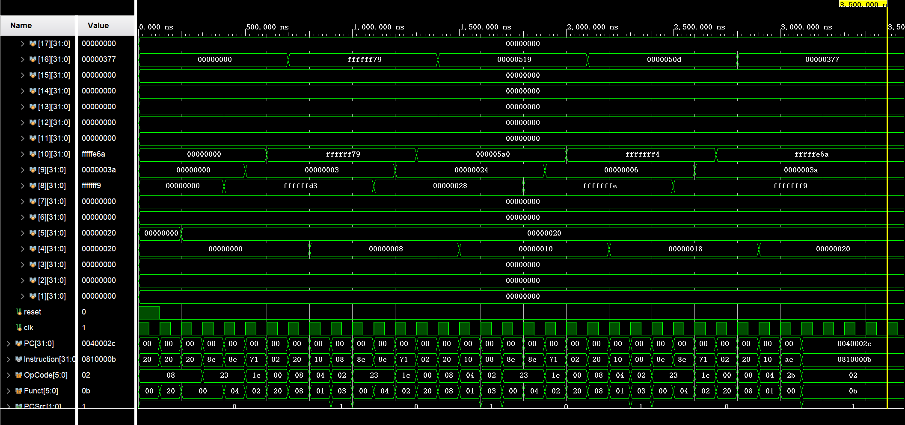
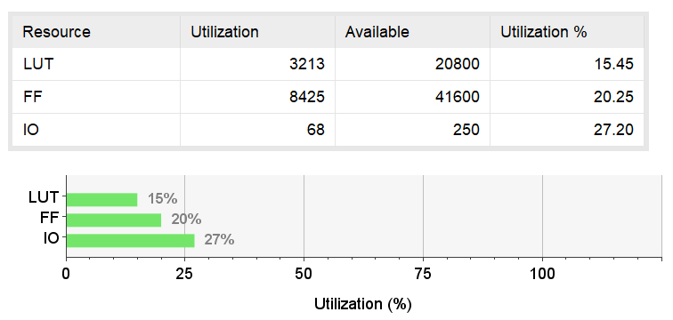
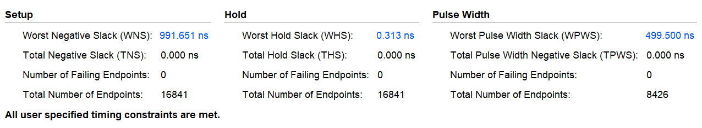
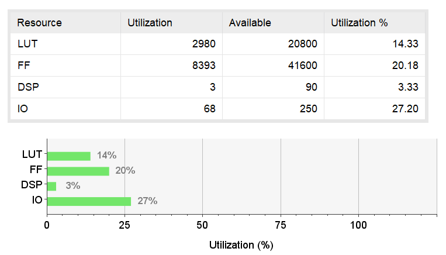
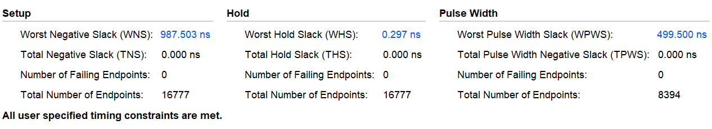

# The Fundamentals of Digital Logic and Processors Project: Processor: MIPS Single-Cycle Processor

## MIPS single-cycle processor

### a)

**According to the functions of each control signal, fill in the following true table of the MIPS instruction subset and control signals (fill in 0, 1, 2, x, etc.), and implement the Verilog code in the control module (`Control.v`) under the single-cycle folder.**

|       | PCSrc[1:0] | Branch | RegWrite | RegDst[1:0] | MemRead | MemWrite | MemtoReg[1:0] | ALUSrc1 | ALUSrc2 | ExtOp | LuOp |
| ----: | ---------: | -----: | -------: | ----------: | ------: | -------: | ------------: | ------: | ------: | ----: | ---: |
|    lw |          0 |      0 |        1 |           0 |       1 |        0 |             1 |       0 |       1 |     1 |    0 |
|    sw |          0 |      0 |        0 |           x |       0 |        1 |             x |       0 |       1 |     1 |    0 |
|   lui |          0 |      0 |        1 |           0 |       0 |        0 |             0 |       0 |       1 |     x |    1 |
|   add |          0 |      0 |        1 |           1 |       0 |        0 |             0 |       0 |       0 |     x |    x |
|  addu |          0 |      0 |        1 |           1 |       0 |        0 |             0 |       0 |       0 |     x |    x |
|   sub |          0 |      0 |        1 |           1 |       0 |        0 |             0 |       0 |       0 |     x |    x |
|  subu |          0 |      0 |        1 |           1 |       0 |        0 |             0 |       0 |       0 |     x |    x |
|  addi |          0 |      0 |        1 |           0 |       0 |        0 |             0 |       0 |       1 |     1 |    0 |
| addiu |          0 |      0 |        1 |           0 |       0 |        0 |             0 |       0 |       1 |     1 |    0 |
|   mul |          0 |      0 |        1 |           1 |       0 |        0 |             0 |       0 |       0 |     x |    x |
|   and |          0 |      0 |        1 |           1 |       0 |        0 |             0 |       0 |       0 |     x |    x |
|    or |          0 |      0 |        1 |           1 |       0 |        0 |             0 |       0 |       0 |     x |    x |
|   xor |          0 |      0 |        1 |           1 |       0 |        0 |             0 |       0 |       0 |     x |    x |
|   nor |          0 |      0 |        1 |           1 |       0 |        0 |             0 |       0 |       0 |     x |    x |
|  andi |          0 |      0 |        1 |           0 |       0 |        0 |             0 |       0 |       1 |     0 |    0 |
|   sll |          0 |      0 |        1 |           1 |       0 |        0 |             0 |       1 |       0 |     x |    x |
|   srl |          0 |      0 |        1 |           1 |       0 |        0 |             0 |       1 |       0 |     x |    x |
|   sra |          0 |      0 |        1 |           1 |       0 |        0 |             0 |       1 |       0 |     x |    x |
|   slt |          0 |      0 |        1 |           1 |       0 |        0 |             0 |       0 |       0 |     x |    x |
|  sltu |          0 |      0 |        1 |           1 |       0 |        0 |             0 |       0 |       0 |     x |    x |
|  slti |          0 |      0 |        1 |           0 |       0 |        0 |             0 |       0 |       1 |     1 |    0 |
| sltiu |          0 |      0 |        1 |           0 |       0 |        0 |             0 |       0 |       1 |     1 |    0 |
|   beq |          0 |      1 |        0 |           x |       0 |        0 |             x |       0 |       0 |     1 |    0 |
|     j |          1 |      x |        0 |           x |       0 |        0 |             x |       x |       x |     x |    x |
|   jal |          1 |      x |        1 |           2 |       0 |        0 |             2 |       x |       x |     x |    x |
|    jr |          2 |      x |        0 |           x |       0 |        0 |             x |       x |       x |     x |    x |
|  jalr |          2 |      x |        1 |           2 |       0 |        0 |             2 |       x |       x |     x |    x |

We can implement the control module as follows:

```verilog
assign PCSrc = 
  (OpCode == 6'h02 || OpCode == 6'h03)? 2'b01: //j, jal
  (OpCode == 6'h00 && Funct == 6'h08)? 2'b10: //jr
  2'b00; //others
assign Branch = 
  (OpCode == 6'h04)? 1'b1: //beq
  1'b0; //others
assign RegWrite =
  (OpCode == 6'h2b || OpCode == 6'h03 || (OpCode == 6'h00 && Funct == 6'h08))? 1'b0: //sw, j, jr
  1'b1; //others
assign RegDst =
  (OpCode == 6'h03 || (OpCode == 6'h00 && Funct == 6'h09))? 2'b10: //jal, jalr
  (OpCode == 6'h23 || OpCode == 6'h0f || OpCode == 6'h08 || OpCode == 6'h09 || OpCode == 6'h0c || OpCode == 6'h0a || OpCode == 6'h0b)? 2'b00: //lw, lui, addi, addiu, andi, slti, sltiu
  2'b01; //others
assign MemRead =
  (OpCode == 6'h23)? 1'b1: //lw
  1'b0; //others
assign MemWrite =
  (OpCode == 6'h2b)? 1'b1: //sw
  1'b0; //others
assign MemtoReg =
  (OpCode == 6'h23)? 2'b01: //lw
  (OpCode == 6'h03)? 2'b10: //jal
  2'b00; //others
assign ALUSrc1 =
  ((OpCode == 6'h00 && Funct == 6'h00) || (OpCode == 6'h00 && Funct == 6'h02) || (OpCode == 6'h00 && Funct == 6'h03))? 1'b1: //sll, srl, sra
  1'b0; //others
assign ALUSrc2 =
  (OpCode == 6'h23 || OpCode == 6'h2b || OpCode == 6'h0f || OpCode == 6'h08 || OpCode == 6'h09 || OpCode == 6'h0c || OpCode == 6'h0a || OpCode == 6'h0b)? 1'b1: //lw, sw, lui, addi, addiu, andi, slti, sltiu
  1'b0; //others
assign ExtOp =
  (OpCode == 6'h0c)? 1'b0: //andi
  1'b1; //others
assign LuOp =
  (OpCode == 6'h0f)? 1'b1: //lui
  1'b0; //others
```

### b)

**Read the code in MIPS Assembly 1-1. After the program runs long enough, what are the values of the register `$v0`, `$v1`, `$a0`, `$a1`, `$a2`, `$a3`, `$t0`, `$t1`, `$t2`, and `$t3`, respectively (which are corresponding to registers 2-11)?**

```assembly
    addi    $a0,    $zero,      12123   # $a0 = 12123 = 0x00002F5B
    addiu   $a1,    $zero,      -12345  # $a1 = -12345 = 0xFFFFCFC7
    sll     $a2,    $a1,        16      # $a2 = $a1 << 16 = 0xCFC70000
    sra     $a3,    $a2,        16      # $a3 = $a2 >> 16 = 0xFFFFCFC7
    sw      $a0,    0($zero)            # Memory[0] = $a0 = 0x00002F5B
    beq     $a3,    $a1,        L1      # if $a3 == $a1, branch to L1
    lui     $a0,    22222               # Not executed

L1: 
    add     $t0,    $a2,        $a0     # $t0 = $a2 + $a0 = 0xCFC72F5B
    sra     $t1,    $t0,        8       # $t1 = $t0 >> 8 = 0xFFCFC72F
    addi    $t2,    $zero,      -12123  # $t2 = -12123 = 0xFFFFD0A5
    slt     $v0,    $a0,        $t2     # $v0 = ($a0 < $t2) = 0
    sltu    $v1,    $a0,        $t2     # $v1 = ($a0 < $t2 unsigned) = 1
    lw      $t3,    0($zero)            # $t3 = Memory[0] = 0x00002F5B

Loop:
    j       Loop                        # Infinite loop
```

The values of the registers are as follows: 

- `$v0` = 0
- `$v1` = 1
- `$a0` = `0x00002F5B` = 12123
- `$a1` = `0xFFFFCFC7` = -12345
- `$a2` = `0xCFC70000` = -809041920
- `$a3` = `0xFFFFCFC7` = -12345
- `$t0` = `0xCFC72F5B` = -809029797
- `$t1` = `0xFFCFC72F` = -3160273
- `$t2` = `0xFFFFD0A5` = -12123
- `$t3` = `0x00002F5B` = 12123

## c)

**Copy the code in `Inst-q1.txt` to the corresponding location in `InstructionMemory.v`; Copy the code in `Data-q1.txt` to the corresponding location in `DataMemory.v`. Finish the simulation based on the top module (i.e., `test_cpu.v`). Please show the simulation waveforms of the registers in b), and verify the correctness of the calculation results and the functions of the designed single-cycle processor.**



The simulation waveforms show that the values of the registers are consistent with the results in b). The program runs correctly and the values of the registers are as expected.

## d)

**Read the code in MIPS Assembly 1-2, which implements the function of: $z = \sum_{k=0}^3 x_k y_k$. After the program runs long enough, what are the values of the register `$a0`, `$a1`, and `$s0`, respectively?**

```assembly
INIT:
    addi    $a0,    $zero,  0   # $a0 = 0
    addi    $a1,    $zero,  32  # $a1 = 32
    addi    $s0,    $zero,  0   # $s0 = 0
LOOP:
    lw      $t0,    0($a0)      # $t0 = Memory[$a0]
    lw      $t1,    4($a0)      # $t1 = Memory[$a0 + 4]
    mul     $t2,    $t0,    $t1 # $t2 = $t0 * $t1
    add     $s0,    $s0,    $t2 # $s0 = $s0 + $t2
    addi    $a0,    $a0,    8   # $a0 = $a0 + 8
    beq     $a0,    $a1,    L1  # If $a0 == $a1, jump to L1
    j       LOOP                # Jump to LOOP
L1: 
    sw      $s0,    0($a1)      # Memory[$a1] = $s0
END:
    j       END                 # Infinite loop
```

The values of the registers are as follows:

- `$a0` = 32 = `0x00000020`
- `$a1` = 32 = `0x00000020`
- `$s0` = $\sum_{k=0}^3 x_k y_k$

If we use the values in `Data-q1.txt`, we have `$s0` = (-45) × 3 + 40 × 36 + (-2) × 6 + (-7) × 58 = 887 = `0x00000377`.

## e)

**Copy the code in `Inst-q1-2.txt` (corresponding to MIPS Assembly 1-2) to the corresponding location in `InstructionMemory.v`; Copy the code in `Data-q1.txt` to the corresponding location in `DataMemory.v`. Finish the simulation using ModelSim, Vivado or other simulators. The top module is `test_cpu.v`. Please show the simulation waveforms of the registers in d), and verify the correctness of the calculation results and the functions of the designed single-cycle processor.**



The simulation waveforms show that the values of the registers are consistent with the results in d). The program runs correctly and the values of the registers are as expected.

## f)

**Using the FPGA board in the experiment course, finish the synthesis and static timing analysis (STA) in Vivado. Require to use the constraint file in the attachment (i.e., `xdc_for_both.xdc`). Based on the resource utilization report and timing report in Vivado, show the maximum clock frequency and the resource utilization of CPU. Please include the corresponding screenshots of the resource utilization report and timing report in Vivado.**

- `Inst-q1-1.txt`
  - 
  - 
  - The maximum clock frequency is $\frac{1}{1000 \text{ns} - 991.651 \text{ns}} = 119.775 \text{MHz}$.
- `Inst-q1-2.txt`
  - 
  - 
  - The maximum clock frequency is $\frac{1}{1000 \text{ns} - 987.503 \text{ns}} = 80.019 \text{MHz}$.